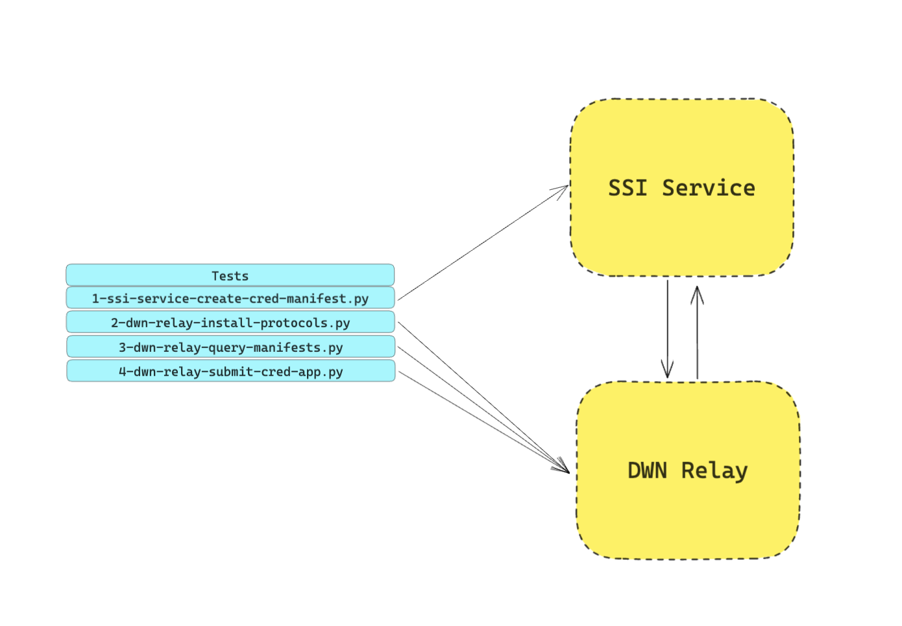

# Web5 Components Tests

This repo is used to orchestrate end to end testing of Web5 components.

This repo contains a docker-compose file which pulls down and spins up the latest components from mainline of the WEB5 stack. It then runs test suites against the endpoints of these services.



## Running System Test Locally

1. Clone the repo

```bash 
git clone https://github.com/TBD54566975/web5-components-tests.git
```

2. Spin up the ssi-service and dwn-relay. **Note:** is is important to use --no cache because if you don't it will not use the latest version of mainline

```bash
docker-compose build --no-cache && docker-compose up
```

3. In a new shell navigate to web5-components-tests/tests and run a test script in the tests directory. To run all tests run:
```bash
cd tests
pip install -r requirements.txt
pip install -U pytest

# The -rP command allows you see all the output from the tests
pytest -rP 
```

## Directory Structure

To add a new test simply create a file in the integration folder and follow the example of our end to end steelthread test

```bash
tests
tests/integration
tests/integration/test_steelthread.py
```

## Tests

## Test 1 – test_steelthread.py ✅

The test runs HTTP requests against the DWN Relay from the perspective of Alice:

1. Creates an issuer DID in the ssi-service
2. Creates a schema in the ssi-service to be used in reference to the credential manifest
3. Creates a credential manifest in the ssi-service to be applied to from a submitted credential application
4. Installs DWN protocols to the DWN. DWN protocols are used by the DWN to understnad what it needs to do with requests. It's basically a mapping of input route to an output route
5. Queries the DWN for a credential manifest. The DWN will query the ssi-service for the manifest and return it to the DWN-Relay
6. Submits a credential application to the DWN. The DWN will submit the credential application to the ssi-service for the credential response containing the verifiable credential

## Automatic Runs Via Github Actions

When a new verion of a web5 component is pushed up the github action pulls down and spins up the latest components from the WEB5 stack and runs tests against them. The github actions can be seen here - https://github.com/TBD54566975/web5-components-tests/actions

## Project Resources

| Resource                                   | Description                                                                   |
| ------------------------------------------ | ----------------------------------------------------------------------------- |
| [CODEOWNERS](./CODEOWNERS)                 | Outlines the project lead(s)                                                  |
| [CODE_OF_CONDUCT.md](./CODE_OF_CONDUCT.md) | Expected behavior for project contributors, promoting a welcoming environment |
| [CONTRIBUTING.md](./CONTRIBUTING.md)       | Developer guide to build, test, run, access CI, chat, discuss, file issues    |
| [GOVERNANCE.md](./GOVERNANCE.md)           | Project governance                                                            |
| [LICENSE](./LICENSE)                       | Apache License, Version 2.0                                                   |
